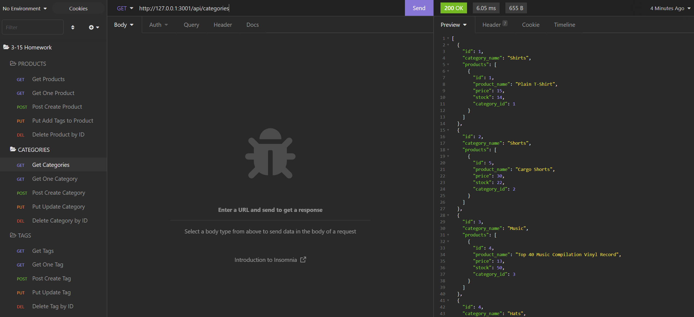

# E-Commerce Backend

## Description

This app uses mysql, sequelize, and other libraries from npm to create a database for a shop. 

# Table of Contents

- [Installation](#installation)
- [Usage](#usage)
- [Credits](#credits)
- [License](#license)
- [Questions](#questions)

## Installation

All parts are already set up.  Just need to run "NPM install", then run Mysql and source the schema, run "npm run seed", and finally "npm start."  At this point, you will be able to interact with the database with software such as Insomniac.

## Usage

You can give parameters to the database to either see the database, or add/update/delete values.

## Credits

Daniel Holland

## License

MIT

## Questions

Please check out my Github, and message me for any issues, suggestions, or questions!

https://github.com/Seyaryu
    